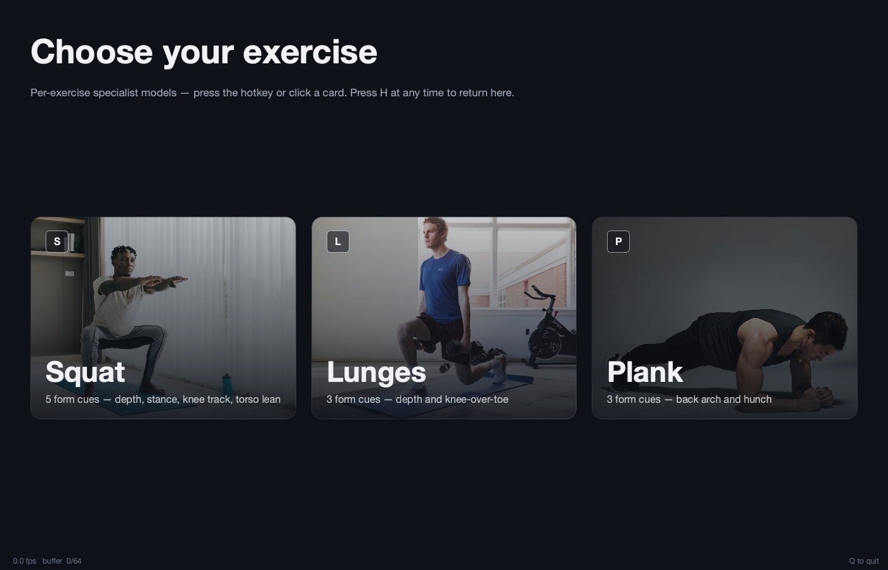

# Posture Coach

Live workout form classifier — final project for the Pattern Recognition graduate class (Waseda, Spring 2026).

**Team**: Haruki Oyama, Shuma Kise, Jina Lee.

Three per-exercise Hybrid-STGCN specialists trained on EC3D 3D-pose data, deployed as a PyQt6 desktop app driven by MediaPipe pose estimation. The user picks Squat, Lunges, or Plank on a welcome screen; the selected exercise's 4-seed ensemble classifies form errors in real time and (optionally) an Ollama-backed coach offers a one-line cue when form is off.



## Requirements

- macOS with a webcam.
- Python 3.12.
- Homebrew + Ollama (optional — for the coaching panel).

## Setup

### 1. Clone and install

```bash
git clone https://github.com/harukioya/Pattern-Recognition-Project-Posture-Detector.git
cd Pattern-Recognition-Project-Posture-Detector
python3 -m venv venv
source venv/bin/activate
pip install -U pip
pip install -r requirements.txt
```

### 2. Download the MediaPipe pose-landmarker models

```bash
mkdir -p models
curl -sL -o models/pose_landmarker_heavy.task \
  https://storage.googleapis.com/mediapipe-models/pose_landmarker/pose_landmarker_heavy/float16/latest/pose_landmarker_heavy.task
curl -sL -o models/pose_landmarker_lite.task \
  https://storage.googleapis.com/mediapipe-models/pose_landmarker/pose_landmarker_lite/float16/latest/pose_landmarker_lite.task
```

### 3. Download the EC3D dataset

Follow the Google Drive link in [Jacoo-Zhao/3D-Pose-Based-Feedback-For-Physical-Exercises](https://github.com/Jacoo-Zhao/3D-Pose-Based-Feedback-For-Physical-Exercises) and place `data_3D.pickle` (21 MB) into `data/`.

### 4. Train the per-exercise specialists (~25 min on Apple Silicon)

```bash
for ex in SQUAT Lunges Plank; do
  lower=$(echo "$ex" | tr '[:upper:]' '[:lower:]')
  for seed in 0 1 2 3; do
    python src/train.py --arch hybrid --feature-mode pose_extras \
      --train-split trainval --epochs 60 --seed $seed \
      --ckpt-tag pex_${lower}_s${seed} \
      --exercise-filter $ex --include-self-data --quiet
  done
done
```

Produces 12 checkpoints under `checkpoints/` (4 seeds × 3 exercises) matching the filenames the app loads.

### 5. Launch the app

```bash
python src/app/run.py
```

macOS will prompt for camera permission on first launch.

## Using the app

Pick an exercise on the welcome screen — `S` squat, `L` lunges, `P` plank, or click a card. The workout view shows the camera with a MediaPipe skeleton overlay on the left and, on the right, the top form verdict, per-class probability bars for that exercise, and the coaching panel.

- `H` / `Home` / `Esc` — return to the welcome screen.
- `Q` — quit.

## Optional workout recording, review, and SAM3D mesh generation

This branch also includes a workout recording flow and a video reviewer that
can send the paused frame to Meta's SAM 3D Body model. SAM3D is intentionally
kept outside this repository: do not commit Docker images, model checkpoints,
`requests/`, or generated `outputs/` to this project.

The reviewer currently uses a Docker backend. Docker is only used to provide a
Linux CUDA/PyTorch environment for SAM3D; the posture app code remains in this
repository.

### Recommended Windows + Docker layout

```text
Pattern-Recognition-Project-Posture-Detector/   # this repository
E:/DockerE/SAM3D/                               # external SAM3D workspace
  sam-3d-body/                                  # official Meta SAM3D repo
  requests/                                     # generated frames, ignored
  outputs/                                      # generated PNG/OBJ, ignored
```

The examples below use E:\DockerE\SAM3D as the external workspace. If you choose a different location, set the environment variables shown below before launching the reviewer.

From PowerShell, create the external SAM3D workspace and clone SAM3D:

```powershell
mkdir E:\DockerE\SAM3D
cd E:\DockerE\SAM3D
git clone https://github.com/facebookresearch/sam-3d-body.git
```

The mesh-export helper lives in this repository at
`tools/sam3d/demo_export_mesh.py`. The reviewer copies that helper into the
external SAM3D checkout before each generation job, so the submitted project
contains the custom SAM3D bridge code while the official SAM3D repo remains an
external dependency.

Create or start the Docker container. The mount path must match what the app
uses as `SAM3D_CONTAINER_ROOT`:

```powershell
docker run --gpus all -it --name sam3d_body `
  --shm-size=16g `
  -v E:\DockerE\SAM3D:/workspace/SAM3D `
  pytorch/pytorch:2.5.1-cuda12.4-cudnn9-devel
```

Inside the container, follow the official SAM3D installation guide. The minimum
setup used for this project is:

```bash
cd /workspace/SAM3D/sam-3d-body
apt-get update
apt-get install -y git ffmpeg libgl1 libglib2.0-0 libegl1 build-essential ninja-build cmake
pip install -U pip
pip install pytorch-lightning pyrender opencv-python yacs scikit-image einops timm dill pandas rich hydra-core hydra-submitit-launcher hydra-colorlog pyrootutils webdataset chump networkx==3.2.1 roma joblib seaborn wandb appdirs appnope ffmpeg cython jsonlines pytest xtcocotools loguru optree fvcore black pycocotools tensorboard huggingface_hub
pip install 'git+https://github.com/facebookresearch/detectron2.git@a1ce2f9' --no-build-isolation --no-deps
pip install git+https://github.com/microsoft/MoGe.git
hf auth login
hf download facebook/sam-3d-body-dinov3 --local-dir checkpoints/sam-3d-body-dinov3
```

The Hugging Face checkpoint repository requires approval before `hf download`
will work. See the official SAM3D repository and `INSTALL.md` for the latest
model-access rules.

If the container already exists but is stopped, restart it with:

```powershell
docker start sam3d_body
```

The reviewer defaults are:

```powershell
$env:SAM3D_HOST_ROOT = "E:\DockerE\SAM3D"
$env:SAM3D_CONTAINER = "sam3d_body"
$env:SAM3D_CONTAINER_ROOT = "/workspace/SAM3D"
```

Set those variables only if your paths or container name differ.

### Run the recording and review tools

Record a video for any supported exercise from the same mode picker used by the main app:

```powershell
python src/app/run_record.py
```

Open the video reviewer and generate a SAM3D mesh from a paused frame:

```powershell
python src/app/run_squat_review.py
```

In the reviewer, choose a video, pause on a frame, then click `Generate 3D`.
Outputs are written under:

```text
E:/DockerE/SAM3D/outputs/<job_id>/
```

The main files are:

```text
frame.png                 # SAM3D rendered preview
frame_person0.obj         # raw SAM3D OBJ
frame_person0_viewer.obj  # viewer-oriented OBJ for tools like Windows 3D Viewer
```
## Optional: coaching panel

```bash
brew install ollama
brew services start ollama
ollama pull llama3.2:3b
```

Without Ollama the coach panel is idle; everything else still works.

## Optional: fine-tune on your own body

```bash
python src/record_self_data.py
```

Records short MediaPipe clips of the 11 form classes into `data/self_recorded/`. Re-run the step 4 training command afterwards — `--include-self-data` folds them in alongside EC3D.

## Repository layout

```
src/
├── ec3d_dataset.py         EC3D loader + feature extraction
├── model.py                Model heads (BiLSTM / Transformer / ST-GCN / Hybrid)
├── train.py                Trainer; --exercise-filter selects the specialist
├── ensemble_eval.py        Evaluate an ensemble on EC3D test
├── self_data.py            SelfRecordedDataset for fine-tuning
├── record_self_data.py     Interactive self-recording tool
├── blazepose_to_body25.py  MediaPipe 33-joint → BODY_25 mapping
└── app/                    PyQt6 desktop app
```

## Acknowledgments

- EC3D dataset: Zhao et al., "3D Pose Based Feedback for Physical Exercises," ACCV 2022.
- MediaPipe Pose: Google Research.
- Built for the Pattern Recognition class (Spring 2026) under instructors Ogawa, Kobayashi, Hayashi, and Hayamizu.
